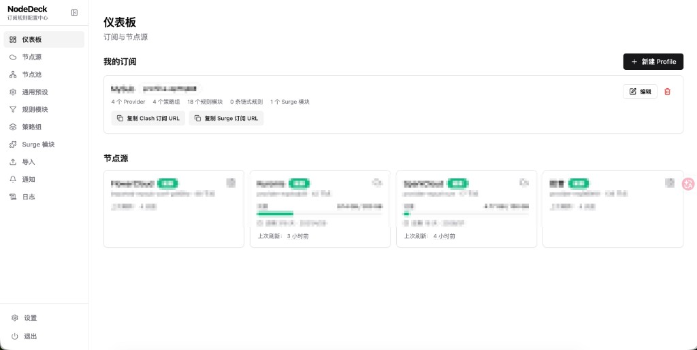

# NodeDeck

> Clash + Surge 订阅转换器,带 Web 配置中心。

把多个机场订阅、本地节点和自定义规则,统一生成 **Clash Meta (Mihomo)** 与 **Surge 5** 订阅。后端 Node.js + Hono,前端 React,单 Docker 镜像部署,所有配置以文件持久化、改完即生效。



## 特性

- **多 Profile**:一份配置中心生成多套订阅,每个 Profile 独立 URL 和 token,可一键重生。
- **节点源混合**:在线订阅 + 本地文件 + 手动录入,自动去重;多机场重名节点自动加来源前缀(如 `【主力】香港 01`)区分,避免客户端加载冲突。
- **可视化拼装**:规则、策略组、Surge 模块、DNS / TUN 等配置全部在 Web UI 编辑,支持 RULE-SET / inline / GEOSITE / GEOIP / DOMAIN-SET 等规则形态。
- **链式代理**:任意节点可设前置代理(Clash `dialer-proxy` / Surge `underlying-proxy`),生成前自动做环检测和悬空引用降级。
- **主流协议**:SS / VMess / VLESS(Reality)/ Trojan / Hysteria2 / TUIC v5 / WireGuard / Snell 等,Clash 与 Surge 两端字段自动对齐。
- **流量信息聚合**:多机场用量按标准 `Subscription-UserInfo` 聚合,Web 仪表板查看每个机场的剩余流量与到期时间。
- **改完不重启**:文件是唯一数据源,保存后缓存自动失效,订阅即时更新。

## 快速开始

### Docker(推荐)

服务器只需 Docker,镜像从 GHCR 拉取:

```bash
mkdir -p /opt/nodedeck && cd /opt/nodedeck
curl -fsSL https://raw.githubusercontent.com/MingSpace/NodeDeck/main/docker/docker-compose.yml -o docker-compose.yml
# 编辑 docker-compose.yml,至少改 INITIAL_PASSWORD 和 PUBLIC_BASE_URL 两项
docker compose up -d
```

打开 `http://your-vps:8080`,用 `admin` + 你设置的 `INITIAL_PASSWORD` 登录,首次会强制改密。Session 密钥首启自动生成在 `data/secret.key`,无需手填。

升级:`docker compose pull && docker compose up -d`。完整部署(nginx / Caddy 反代等)见 [docs/deployment.md](docs/deployment.md)。

### 本地开发

```bash
pnpm install
pnpm dev          # 后端 8080 + 前端 5173(自动反代 /api 与 /sub)
pnpm typecheck    # 全 workspace 类型检查
pnpm test         # 后端测试
```

## 订阅 URL

Profile 在 Web UI 创建后自动生成订阅地址,列表页有「复制 URL」按钮:

```
http://your-vps:8080/sub?profile=home&target=clash&t=<token>   # Clash (Mihomo)
http://your-vps:8080/sub?profile=home&target=surge&t=<token>   # Surge 5
```

更多用法(proxy-providers、链式代理等)见 [docs/cookbook.md](docs/cookbook.md)。

## 文档

- [设计概览](docs/design.md)
- [协议字段对照表 (Clash ↔ Surge)](docs/protocol-mapping.md)
- [使用手册](docs/cookbook.md)
- [链式代理用法](docs/chain-proxy.md)
- [部署指南](docs/deployment.md)

## 技术栈

后端 Node.js 20 + Hono + TypeScript,前端 React 18 + Vite + Tailwind + shadcn 风格 + TanStack Query + Monaco。配置以 YAML / JSON 存于 `data/`(挂载到容器),无数据库。

## 不做什么

- 公共服务 / 多用户 / SSO / 计费
- Quantumult X / Loon / V2RayN 等其他客户端输出
- 内置 TLS 终止(交给前置 nginx / Caddy)

## License

MIT
